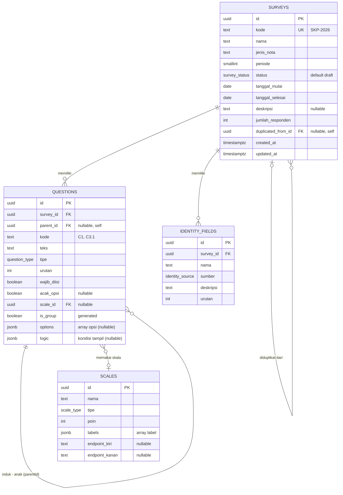

# Arsitektur Database (ERD) — Pelindo Survey CMS

Rancangan skema **compact** untuk backend nyata, diturunkan dari model data front-end
(`src/types/index.ts`) dan store (`src/store/useSurveyStore.ts`). Aplikasi saat ini belum punya
backend (data in-memory — lihat [ARCHITECTURE.md](ARCHITECTURE.md)); dokumen ini cetak biru-nya.

**Prinsip ringkas:** _satu tabel per array di store; data bersarang disimpan apa adanya sebagai `JSONB`._
Aplikasi ini CMS untuk **menyusun** kuesioner (bukan analitik berat), jadi opsi/kondisi/label tidak
perlu tabel sendiri. Hasilnya **4 tabel** yang mencerminkan persis 4 state array store:

| Store array (front-end) | Tabel DB |
|---|---|
| `surveys` | `surveys` |
| `questions` (berisi `options[]`, `logic`) | `questions` (+ kolom `options jsonb`, `logic jsonb`) |
| `scales` (berisi `labels[]`) | `scales` (+ kolom `labels jsonb`) |
| `identityFields` | `identity_fields` |

> **Efek samping yang enak:** karena kolom JSONB menyimpan objek TS apa adanya, menerjemahkan
> `src/store/seed.ts` jadi `INSERT` nyaris copy-paste, dan `src/data/*` hampir tak perlu ubah bentuk data.

- **DBMS default:** PostgreSQL 14+ (untuk `JSONB`, `ENUM`, generated column). Adaptasi MySQL/SQLite di [§7](#7-adaptasi-dbms-lain).
- Kalau nanti butuh normalisasi penuh (analitik per-opsi/per-jawaban), lihat [§8](#8-kapan-perlu-normalisasi-penuh).

---

## 1. Diagram ERD



| Relasi | Kardinalitas | FK |
|---|---|---|
| Survey → Question | 1 : N (cascade) | `questions.survey_id` |
| Question → Question (hirarki) | 1 : N self-ref (cascade) | `questions.parent_id` |
| Question → Scale | N : 1 opsional | `questions.scale_id` |
| Survey → IdentityField | 1 : N (cascade) | `identity_fields.survey_id` |
| Survey → Survey (duplikat) | N : 1 opsional self-ref | `surveys.duplicated_from_id` |

`options`, `logic`, dan `labels` **bukan** relasi — mereka tersimpan di dalam baris induk.

---

## 2. DDL (PostgreSQL)

### 2.1 Enum

```sql
CREATE EXTENSION IF NOT EXISTS pgcrypto;   -- gen_random_uuid()

CREATE TYPE survey_status   AS ENUM ('draft','aktif','selesai','arsip');
CREATE TYPE question_type   AS ENUM (
  'GRUP','SKALA_KEPUASAN','SKALA_PERSETUJUAN','NPS',
  'YA_TIDAK','PILIHAN_TUNGGAL','PILIHAN_GANDA','TEKS'
);
CREATE TYPE identity_source AS ENUM ('OTOMATIS','ISIAN','PILIHAN','SISTEM');
CREATE TYPE scale_type      AS ENUM ('KEPUASAN','PERSETUJUAN','NPS');
-- jenis_nota dibiarkan TEXT (kandidat master-data) — divalidasi di aplikasi.
```

### 2.2 `surveys`

```sql
CREATE TABLE surveys (
  id                  uuid PRIMARY KEY DEFAULT gen_random_uuid(),
  kode                text          NOT NULL UNIQUE,      -- "SKP-2026"
  nama                text          NOT NULL,
  jenis_nota          text          NOT NULL,             -- Domestik | Internasional | SPSL Group
  periode             smallint      NOT NULL,
  status              survey_status NOT NULL DEFAULT 'draft',
  tanggal_mulai       date          NOT NULL,
  tanggal_selesai     date          NOT NULL,
  deskripsi           text,
  jumlah_responden    integer       NOT NULL DEFAULT 0,
  duplicated_from_id  uuid          REFERENCES surveys(id) ON DELETE SET NULL,
  created_at          timestamptz   NOT NULL DEFAULT now(),
  updated_at          timestamptz   NOT NULL DEFAULT now(),   -- = terakhirDiubah
  CHECK (tanggal_selesai >= tanggal_mulai)
);
```

### 2.3 `scales`  (global, `labels` sebagai JSONB)

```sql
CREATE TABLE scales (
  id             uuid PRIMARY KEY DEFAULT gen_random_uuid(),
  nama           text       NOT NULL,
  tipe           scale_type NOT NULL,
  poin           smallint   NOT NULL,
  labels         jsonb      NOT NULL,   -- ["Sangat tidak puas","Tidak puas","Puas","Sangat puas"]
  endpoint_kiri  text,                  -- NPS
  endpoint_kanan text                   -- NPS
);
```

### 2.4 `questions`  (`options` & `logic` sebagai JSONB)

```sql
CREATE TABLE questions (
  id          uuid PRIMARY KEY DEFAULT gen_random_uuid(),
  survey_id   uuid          NOT NULL REFERENCES surveys(id) ON DELETE CASCADE,
  parent_id   uuid          REFERENCES questions(id)        ON DELETE CASCADE,
  kode        text          NOT NULL,                  -- "C1", "C3.1"
  teks        text          NOT NULL,
  tipe        question_type NOT NULL,
  urutan      integer       NOT NULL,
  wajib_diisi boolean       NOT NULL DEFAULT false,
  acak_opsi   boolean,                                 -- hanya tipe pilihan
  scale_id    uuid          REFERENCES scales(id) ON DELETE RESTRICT,
  is_group    boolean       GENERATED ALWAYS AS (tipe = 'GRUP') STORED,
  options     jsonb,                                   -- array opsi; null bila bukan tipe pilihan
  logic       jsonb,                                   -- { conditions: [...] }; null bila tanpa logika
  created_at  timestamptz   NOT NULL DEFAULT now(),
  updated_at  timestamptz   NOT NULL DEFAULT now(),
  UNIQUE (survey_id, kode)
);

CREATE INDEX idx_questions_survey ON questions (survey_id, urutan);
CREATE INDEX idx_questions_parent ON questions (parent_id);
```

> **Hirarki & cascade** sama seperti front-end: flat + `parent_id`, `ON DELETE CASCADE` meniru
> `deleteQuestion` yang menghapus seluruh keturunan. `is_group` generated → mustahil tak sinkron dengan `tipe`.

### 2.5 `identity_fields`

```sql
CREATE TABLE identity_fields (
  id         uuid PRIMARY KEY DEFAULT gen_random_uuid(),
  survey_id  uuid            NOT NULL REFERENCES surveys(id) ON DELETE CASCADE,
  nama       text            NOT NULL,
  sumber     identity_source NOT NULL,
  deskripsi  text            NOT NULL DEFAULT '',
  urutan     integer         NOT NULL,
  UNIQUE (survey_id, urutan)
);
```

> **Mau lebih compact lagi → 3 tabel?** Fold `identity_fields` jadi kolom `surveys.identity_fields jsonb`
> (sama filosofinya dengan `options`/`logic`). Saya pertahankan sebagai tabel di sini karena field
> identitas di-reorder & diedit per-baris, dan ini mencerminkan array `identityFields` di store.

---

## 3. Bentuk JSONB (objek TS disimpan apa adanya)

Kolom JSONB menyimpan **persis** tipe dari `src/types/index.ts`:

```jsonc
// questions.options  ←  QuestionOption[]   (PILIHAN_TUNGGAL / PILIHAN_GANDA)
[
  { "id": "opt_1", "label": "Sangat setuju", "skor": 4, "urutan": 1 },
  { "id": "opt_2", "label": "Setuju",        "skor": 3, "urutan": 2 }
]

// questions.logic  ←  ConditionGroup        (logika tampil; semua AND)
{
  "conditions": [
    { "sourceQuestionKode": "C3", "operator": "sama_dengan", "value": "Ya" }
  ]
}

// scales.labels  ←  string[]
["Sangat tidak puas", "Tidak puas", "Puas", "Sangat puas"]
```

Reorder opsi/kondisi = tulis ulang array JSONB (operasi murah, persis seperti store menyusun array).

---

## 4. Pemetaan Tipe TS → Kolom

| `src/types/index.ts` | Kolom DB | Catatan |
|---|---|---|
| `Survey.terakhirDiubah` / `createdAt` | `updated_at` / `created_at` | `updated_at` via trigger |
| `Survey.jumlahPertanyaan` | — (derived, [§5](#5-jumlah-pertanyaan-derived)) | tidak disimpan |
| `Survey.duplicatedFrom` (kode) | `duplicated_from_id` (FK self) | integritas referensial |
| `Question.options[]` | `questions.options` (jsonb) | verbatim |
| `Question.logic` | `questions.logic` (jsonb) | verbatim |
| `Question.isGroup` | `questions.is_group` | generated `tipe='GRUP'` |
| `Question.childCount` | — (derived saat baca) | `COUNT(*) WHERE parent_id=…` |
| `Question.scaleId` | `questions.scale_id` (FK) | hanya tipe skala |
| `Scale.labels[]` | `scales.labels` (jsonb) | verbatim |
| `Condition.sourceQuestionKode` | di dalam `logic` jsonb | tetap berbasis `kode` (lihat trade-off §8) |

---

## 5. Jumlah pertanyaan (derived)

Front-end menyimpan `jumlahPertanyaan` & `childCount` dan menjaganya di action. Di DB cukup **dihitung saat baca** (satu sumber kebenaran):

```sql
-- jumlah pertanyaan non-grup per survei (padanan countNonGroup)
SELECT survey_id, COUNT(*) FILTER (WHERE NOT is_group) AS jumlah_pertanyaan
FROM questions GROUP BY survey_id;

-- childCount saat menyajikan tree (padanan recalcChildCount)
SELECT q.*, (SELECT COUNT(*) FROM questions c WHERE c.parent_id = q.id) AS child_count
FROM questions q WHERE q.survey_id = $1 ORDER BY q.urutan;
```

---

## 6. Fase 2 — Responden & Jawaban (opsional)

Belum ada di front-end (tab Hasil stub). Bila perlu menampung jawaban, tambah dua tabel; jawaban
tetap rapi sebagai kolom (bukan JSONB) karena di sinilah analitik benar-benar terjadi:

```sql
CREATE TABLE responses (
  id           uuid PRIMARY KEY DEFAULT gen_random_uuid(),
  survey_id    uuid        NOT NULL REFERENCES surveys(id) ON DELETE CASCADE,
  submitted_at timestamptz NOT NULL DEFAULT now()
);

CREATE TABLE answers (
  id           uuid PRIMARY KEY DEFAULT gen_random_uuid(),
  response_id  uuid NOT NULL REFERENCES responses(id) ON DELETE CASCADE,
  question_id  uuid NOT NULL REFERENCES questions(id) ON DELETE CASCADE,
  value_text   text,     -- TEKS / YA_TIDAK
  value_number integer,  -- skala / NPS
  value_json   jsonb,    -- PILIHAN_GANDA: ["opt_1","opt_3"]
  UNIQUE (response_id, question_id)
);
```

Lalu `jumlah_responden` = `COUNT(responses WHERE survey_id=…)`.

---

## 7. Adaptasi DBMS lain

| Postgres | MySQL 8 | SQLite |
|---|---|---|
| `JSONB` | `JSON` | `TEXT` (JSON) |
| `ENUM` type | `ENUM(...)` inline | `TEXT` + `CHECK (... IN ...)` |
| `uuid` + `gen_random_uuid()` | `CHAR(36)` + `UUID()` | `TEXT`, UUID dari aplikasi |
| `GENERATED … STORED` | `GENERATED` | `GENERATED … VIRTUAL` |
| `COUNT(*) FILTER (WHERE …)` | `SUM(CASE WHEN … THEN 1 END)` | sama seperti MySQL |

JSONB didukung baik di MySQL 8 & SQLite (sebagai teks JSON), jadi desain 4-tabel ini portabel.

---

## 8. Kapan perlu normalisasi penuh

JSONB menukar kemudahan dengan dua hal:

- **Tak ada FK dari isi JSONB.** `logic.sourceQuestionKode` tetap berbasis `kode` (seperti front-end);
  DB tidak menjamin pertanyaan sumber ada — aplikasi yang memvalidasi.
- **Query ke dalam array lebih ribet.** "Semua pertanyaan yang punya opsi dengan skor 4" perlu
  operator JSONB (`@>`, `jsonb_array_elements`), bukan `JOIN` biasa.

Selama backend hanya **menyimpan & menyajikan** kuesioner (kasus saat ini), itu tak masalah. Pindah ke
tabel anak (`question_options`, `question_conditions`, `scale_labels`) hanya bila Anda butuh:
laporan/agregasi per-opsi, FK ketat ke pertanyaan sumber, atau editing opsi konkuren skala besar.
Migrasinya searah: tinggal "ledakkan" array JSONB ke baris-baris tabel anak.

---

## 9. Langkah Integrasi

1. **Migrasi** dari DDL §2 (langsung memetakan ke schema Prisma/Drizzle).
2. **Seed** dari `src/store/seed.ts` → `INSERT`; kolom JSONB diisi objek apa adanya.
3. **Ganti isi `src/data/*`** dari `useSurveyStore.getState()` jadi `fetch` (lihat §11 [ARCHITECTURE.md](ARCHITECTURE.md)).
   Signature tetap → komponen UI tak berubah; helper baca jadi async (tambah loading/error state).
4. **Pindahkan invarian ke server:** count via query §5, cascade via FK, `is_group` via generated column,
   kode otomatis (`nextKode`) jadi logika service.
5. **Transaksi** untuk operasi multi-baris: duplikasi survei (salin questions + remap `parent_id`) dan reorder.
