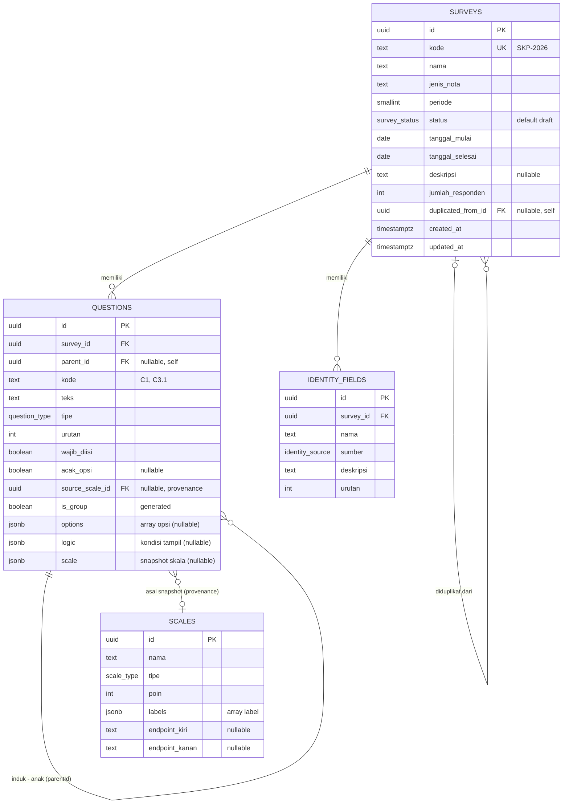
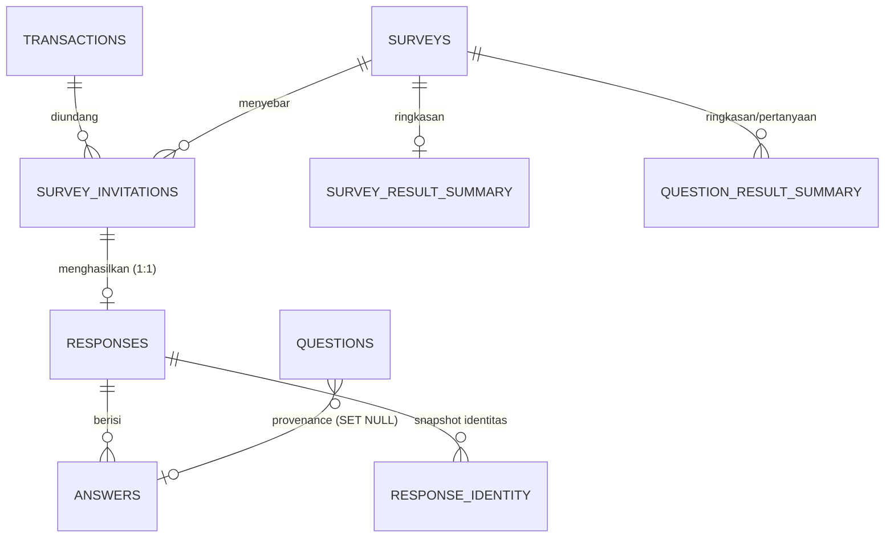

# Arsitektur Database (ERD) — Pelindo Survey CMS

Rancangan skema **compact** untuk backend nyata, diturunkan dari model data front-end
(`src/types/index.ts`) dan store (`src/store/useSurveyStore.ts`). Aplikasi saat ini belum punya
backend (data in-memory — lihat [ARCHITECTURE.md](ARCHITECTURE.md)); dokumen ini cetak biru-nya.

**Prinsip ringkas:** _satu tabel per array di store; data bersarang disimpan apa adanya sebagai `JSONB`._
Aplikasi ini CMS untuk **menyusun** kuesioner (bukan analitik berat), jadi opsi/kondisi/label tidak
perlu tabel sendiri. Hasilnya **4 tabel** yang mencerminkan persis 4 state array store:

| Store array (front-end) | Tabel DB |
|---|---|
| `surveys` | `surveys` |
| `questions` (berisi `options[]`, `logic`, `scale` snapshot) | `questions` (+ kolom `options jsonb`, `logic jsonb`, `scale jsonb`) |
| `scales` (berisi `labels[]`) — **katalog master** | `scales` (+ kolom `labels jsonb`) |
| `identityFields` | `identity_fields` |

> **Skala = master data + snapshot.** `scales` adalah **katalog template** terpusat (dikelola di Master
> data). Saat sebuah pertanyaan memilih skala, definisinya **disalin** jadi snapshot (`questions.scale`).
> Mengedit/menghapus skala master **tidak** mengubah pertanyaan yang sudah memakainya — menjaga
> integritas historis survei yang sudah aktif/selesai. `source_scale_id` hanya menyimpan asal template
> (provenance) untuk fitur "perbarui dari master".

> **Efek samping yang enak:** karena kolom JSONB menyimpan objek TS apa adanya, menerjemahkan
> `src/store/seed.ts` jadi `INSERT` nyaris copy-paste, dan `src/data/*` hampir tak perlu ubah bentuk data.

- **DBMS default:** PostgreSQL 14+ (untuk `JSONB`, `ENUM`, generated column). Adaptasi MySQL/SQLite di [§7](#7-adaptasi-dbms-lain).
- Kalau nanti butuh normalisasi penuh (analitik per-opsi/per-jawaban), lihat [§8](#8-kapan-perlu-normalisasi-penuh).

---

## 1. Diagram ERD



| Relasi | Kardinalitas | FK |
|---|---|---|
| Survey → Question | 1 : N (cascade) | `questions.survey_id` |
| Question → Question (hirarki) | 1 : N self-ref (cascade) | `questions.parent_id` |
| Question → Scale (provenance) | N : 1 opsional, **ON DELETE SET NULL** | `questions.source_scale_id` |
| Survey → IdentityField | 1 : N (cascade) | `identity_fields.survey_id` |
| Survey → Survey (duplikat) | N : 1 opsional self-ref | `surveys.duplicated_from_id` |

`options`, `logic`, `labels`, dan `scale` (snapshot) **bukan** relasi — mereka tersimpan di dalam baris
induk. Relasi `Question → Scale` kini **lunak** (provenance saja): render memakai `questions.scale`
snapshot, bukan `JOIN scales`. Karena itu skala master boleh dihapus tanpa merusak survei lama
(FK `SET NULL`, bukan `RESTRICT`).

---

## 2. DDL (PostgreSQL)

### 2.1 Enum

```sql
CREATE EXTENSION IF NOT EXISTS pgcrypto;   -- gen_random_uuid()

CREATE TYPE survey_status   AS ENUM ('draft','aktif','selesai','arsip');
CREATE TYPE question_type   AS ENUM (
  'GRUP','SKALA_KEPUASAN','SKALA_PERSETUJUAN','NPS',
  'YA_TIDAK','PILIHAN_TUNGGAL','PILIHAN_GANDA','TEKS'
);
CREATE TYPE identity_source AS ENUM ('OTOMATIS','ISIAN','PILIHAN','SISTEM');
CREATE TYPE scale_type      AS ENUM ('KEPUASAN','PERSETUJUAN','NPS');
-- jenis_nota dibiarkan TEXT (kandidat master-data) — divalidasi di aplikasi.
```

### 2.2 `surveys`

```sql
CREATE TABLE surveys (
  id                  uuid PRIMARY KEY DEFAULT gen_random_uuid(),
  kode                text          NOT NULL UNIQUE,      -- "SKP-2026"
  nama                text          NOT NULL,
  jenis_nota          text          NOT NULL,             -- Domestik | Internasional | SPSL Group
  periode             smallint      NOT NULL,
  status              survey_status NOT NULL DEFAULT 'draft',
  tanggal_mulai       date          NOT NULL,
  tanggal_selesai     date          NOT NULL,
  deskripsi           text,
  jumlah_responden    integer       NOT NULL DEFAULT 0,
  duplicated_from_id  uuid          REFERENCES surveys(id) ON DELETE SET NULL,
  created_at          timestamptz   NOT NULL DEFAULT now(),
  updated_at          timestamptz   NOT NULL DEFAULT now(),   -- = terakhirDiubah
  CHECK (tanggal_selesai >= tanggal_mulai)
);
```

### 2.3 `scales`  (katalog master, `labels` sebagai JSONB)

Katalog template terpusat (dikelola di Master data). **Tidak** dibaca saat render survei — nilai yang
dipakai pertanyaan ada di `questions.scale` (snapshot). Karena itu baris di sini boleh diedit/dihapus
bebas tanpa memengaruhi survei lama.

```sql
CREATE TABLE scales (
  id             uuid PRIMARY KEY DEFAULT gen_random_uuid(),
  nama           text       NOT NULL,
  tipe           scale_type NOT NULL,
  poin           smallint   NOT NULL,
  labels         jsonb      NOT NULL,   -- ["Sangat tidak puas","Tidak puas","Puas","Sangat puas"]
  endpoint_kiri  text,                  -- NPS
  endpoint_kanan text                   -- NPS
);
```

### 2.4 `questions`  (`options`, `logic`, `scale` sebagai JSONB)

```sql
CREATE TABLE questions (
  id              uuid PRIMARY KEY DEFAULT gen_random_uuid(),
  survey_id       uuid          NOT NULL REFERENCES surveys(id) ON DELETE CASCADE,
  parent_id       uuid          REFERENCES questions(id)        ON DELETE CASCADE,
  kode            text          NOT NULL,              -- "C1", "C3.1"
  teks            text          NOT NULL,
  tipe            question_type NOT NULL,
  urutan          integer       NOT NULL,
  wajib_diisi     boolean       NOT NULL DEFAULT false,
  acak_opsi       boolean,                             -- hanya tipe pilihan
  source_scale_id uuid          REFERENCES scales(id) ON DELETE SET NULL,  -- provenance saja
  is_group        boolean       GENERATED ALWAYS AS (tipe = 'GRUP') STORED,
  options         jsonb,                               -- array opsi; null bila bukan tipe pilihan
  logic           jsonb,                               -- { conditions: [...] }; null bila tanpa logika
  scale           jsonb,                               -- snapshot skala (SKALA_*, NPS); null selainnya
  created_at      timestamptz   NOT NULL DEFAULT now(),
  updated_at      timestamptz   NOT NULL DEFAULT now(),
  UNIQUE (survey_id, kode)
);

CREATE INDEX idx_questions_survey ON questions (survey_id, urutan);
CREATE INDEX idx_questions_parent ON questions (parent_id);
```

> **Hirarki & cascade** sama seperti front-end: flat + `parent_id`, `ON DELETE CASCADE` meniru
> `deleteQuestion` yang menghapus seluruh keturunan. `is_group` generated → mustahil tak sinkron dengan `tipe`.
>
> **Snapshot skala** (`scale`) di-isi saat pertanyaan memilih skala (salin dari master). `source_scale_id`
> hanya menandai asal template (untuk "perbarui dari master"); `ON DELETE SET NULL` karena menghapus
> skala master **tidak boleh** menghapus pertanyaan — snapshot-nya tetap utuh.

### 2.5 `identity_fields`

```sql
CREATE TABLE identity_fields (
  id         uuid PRIMARY KEY DEFAULT gen_random_uuid(),
  survey_id  uuid            NOT NULL REFERENCES surveys(id) ON DELETE CASCADE,
  nama       text            NOT NULL,
  sumber     identity_source NOT NULL,
  deskripsi  text            NOT NULL DEFAULT '',
  urutan     integer         NOT NULL,
  UNIQUE (survey_id, urutan)
);
```

> **Mau lebih compact lagi → 3 tabel?** Fold `identity_fields` jadi kolom `surveys.identity_fields jsonb`
> (sama filosofinya dengan `options`/`logic`). Saya pertahankan sebagai tabel di sini karena field
> identitas di-reorder & diedit per-baris, dan ini mencerminkan array `identityFields` di store.

---

## 3. Bentuk JSONB (objek TS disimpan apa adanya)

Kolom JSONB menyimpan **persis** tipe dari `src/types/index.ts`:

```jsonc
// questions.options  ←  QuestionOption[]   (PILIHAN_TUNGGAL / PILIHAN_GANDA)
[
  { "id": "opt_1", "label": "Sangat setuju", "skor": 4, "urutan": 1 },
  { "id": "opt_2", "label": "Setuju",        "skor": 3, "urutan": 2 }
]

// questions.logic  ←  ConditionGroup        (logika tampil; semua AND)
{
  "conditions": [
    { "sourceQuestionKode": "C3", "operator": "sama_dengan", "value": "Ya" }
  ]
}

// scales.labels  ←  string[]
["Sangat tidak puas", "Tidak puas", "Puas", "Sangat puas"]

// questions.scale  ←  ScaleSnapshot  (Scale tanpa `id`; SKALA_* / NPS)
{
  "nama": "Skala puas (4 poin)",
  "tipe": "KEPUASAN",
  "poin": 4,
  "labels": ["Sangat tidak puas", "Tidak puas", "Puas", "Sangat puas"]
  // NPS juga membawa "endpointKiri" / "endpointKanan"
}
```

Reorder opsi/kondisi = tulis ulang array JSONB (operasi murah, persis seperti store menyusun array).

---

## 4. Pemetaan Tipe TS → Kolom

| `src/types/index.ts` | Kolom DB | Catatan |
|---|---|---|
| `Survey.terakhirDiubah` / `createdAt` | `updated_at` / `created_at` | `updated_at` via trigger |
| `Survey.jumlahPertanyaan` | — (derived, [§5](#5-jumlah-pertanyaan-derived)) | tidak disimpan |
| `Survey.duplicatedFrom` (kode) | `duplicated_from_id` (FK self) | integritas referensial |
| `Question.options[]` | `questions.options` (jsonb) | verbatim |
| `Question.logic` | `questions.logic` (jsonb) | verbatim |
| `Question.isGroup` | `questions.is_group` | generated `tipe='GRUP'` |
| `Question.childCount` | — (derived saat baca) | `COUNT(*) WHERE parent_id=…` |
| `Question.sourceScaleId` | `questions.source_scale_id` (FK, SET NULL) | provenance saja (asal template) |
| `Question.scale` (snapshot) | `questions.scale` (jsonb) | dipakai render; lepas dari master |
| `Scale.labels[]` | `scales.labels` (jsonb) | verbatim |
| `Condition.sourceQuestionKode` | di dalam `logic` jsonb | tetap berbasis `kode` (lihat trade-off §8) |

---

## 5. Jumlah pertanyaan (derived)

Front-end menyimpan `jumlahPertanyaan` & `childCount` dan menjaganya di action. Di DB cukup **dihitung saat baca** (satu sumber kebenaran):

```sql
-- jumlah pertanyaan non-grup per survei (padanan countNonGroup)
SELECT survey_id, COUNT(*) FILTER (WHERE NOT is_group) AS jumlah_pertanyaan
FROM questions GROUP BY survey_id;

-- childCount saat menyajikan tree (padanan recalcChildCount)
SELECT q.*, (SELECT COUNT(*) FROM questions c WHERE c.parent_id = q.id) AS child_count
FROM questions q WHERE q.survey_id = $1 ORDER BY q.urutan;
```

---

## 6. Skema Transaksi — Distribusi, Responden & Jawaban

Lapisan **OLTP** untuk mengumpulkan isian responden (tab Hasil). Berbeda dari §2 (CMS untuk
*menyusun* kuesioner), bagian ini *menangkap & menganalisis* jawaban. Keputusan desain (dikonfirmasi):

1. **Snapshot per response.** Saat submit, struktur pertanyaan + skala + bobot **disalin** ke baris
   `answers`. Dashboard membaca dari jawaban responden, **bukan** dari master `questions`/`scales` —
   sehingga mengedit/menghapus pertanyaan tidak menggeser arti data historis. (Konsisten dengan pola
   snapshot skala di §2.4.)
2. **Semua via link ber-token**, di-generate dari **list transaksi** (anchor identitas). Kanal kirim
   (QR di invoice / email) ditentukan **jenis nota**. Identitas `OTOMATIS` diambil dari transaksi.
3. **Sekali submit** — tidak ada draft; satu transaksi DB atomik per pengiriman.
4. **Skor + agregat disimpan** — skor per jawaban (snapshot bobot), plus ringkasan CSI/NPS per survei
   & per pertanyaan, di-refresh saat submit.

### 6.1 ERD (lapisan transaksi)



### 6.2 Enum tambahan

```sql
CREATE TYPE invitation_channel AS ENUM ('QR','EMAIL');
CREATE TYPE invitation_status  AS ENUM ('dibuat','terkirim','dibuka','selesai','kedaluwarsa');
```

### 6.3 `transactions` — sumber identitas (sinkron dari billing)

Representasi lokal "list transaksi" Pelindo; jadi anchor identitas `OTOMATIS` & kunci anti-duplikat.
Kolom umum eksplisit + `attrs jsonb` untuk field yang bervariasi antar jenis nota.

```sql
CREATE TABLE transactions (
  id                uuid PRIMARY KEY DEFAULT gen_random_uuid(),
  no_billing        text NOT NULL UNIQUE,
  jenis_nota        text NOT NULL,              -- Domestik | Internasional | SPSL Group
  nama_cabang       text,
  nama_entitas      text,
  nama_perusahaan   text,                       -- / nama kapal
  email             text,                       -- target kirim bila kanal EMAIL
  attrs             jsonb,                       -- field OTOMATIS lain (fleksibel per jenis nota)
  tanggal_transaksi date,
  created_at        timestamptz NOT NULL DEFAULT now()
);
```

### 6.4 `survey_invitations` — link/token (1 undangan per transaksi per survei)

```sql
CREATE TABLE survey_invitations (
  id             uuid PRIMARY KEY DEFAULT gen_random_uuid(),
  survey_id      uuid NOT NULL REFERENCES surveys(id)      ON DELETE CASCADE,
  transaction_id uuid NOT NULL REFERENCES transactions(id) ON DELETE RESTRICT,
  token          text NOT NULL UNIQUE,          -- dipakai di URL: /isi/:token
  channel        invitation_channel NOT NULL,   -- diturunkan dari jenis_nota
  status         invitation_status  NOT NULL DEFAULT 'dibuat',
  sent_at        timestamptz,
  opened_at      timestamptz,
  expires_at     timestamptz,
  created_at     timestamptz NOT NULL DEFAULT now(),
  UNIQUE (survey_id, transaction_id)            -- cegah undangan ganda
);
CREATE INDEX idx_invitations_survey ON survey_invitations (survey_id, status);
```

### 6.5 `responses` — 1:1 dengan undangan (dibuat saat submit)

```sql
CREATE TABLE responses (
  id            uuid PRIMARY KEY DEFAULT gen_random_uuid(),
  invitation_id uuid NOT NULL UNIQUE REFERENCES survey_invitations(id) ON DELETE CASCADE,
  survey_id     uuid NOT NULL REFERENCES surveys(id) ON DELETE CASCADE, -- denormal: query cepat
  submitted_at  timestamptz NOT NULL DEFAULT now(),
  channel       invitation_channel NOT NULL,
  csi           numeric,        -- indeks kepuasan response ini (0..100), bila relevan
  nps_value     smallint,       -- nilai NPS 0..10 response ini, bila ada
  meta          jsonb           -- user-agent, durasi pengisian, dll.
);
CREATE INDEX idx_responses_survey ON responses (survey_id, submitted_at);
```

> `invitation_id UNIQUE` + `UNIQUE(survey_id, transaction_id)` di undangan = **anti-duplikat berlapis**:
> satu transaksi → satu undangan → satu response. (Sesuai "sekali submit".)

### 6.6 `response_identity` — snapshot nilai identitas (untuk filter dashboard)

Nilai field identitas dibekukan saat submit: `OTOMATIS` dari transaksi, `ISIAN`/`PILIHAN` dari form,
`SISTEM` dari server. Tabel (bukan JSONB) agar mudah **filter/group** (mis. CSI per Nama Cabang).

```sql
CREATE TABLE response_identity (
  id          uuid PRIMARY KEY DEFAULT gen_random_uuid(),
  response_id uuid NOT NULL REFERENCES responses(id) ON DELETE CASCADE,
  nama        text NOT NULL,            -- "Nama Cabang", "Kategori Responden"
  sumber      identity_source NOT NULL,
  nilai       text,                     -- nilai tersnapshot
  urutan      integer NOT NULL,
  UNIQUE (response_id, nama)
);
CREATE INDEX idx_resp_identity_filter ON response_identity (nama, nilai);
```

### 6.7 `answers` — 1 per (response, pertanyaan), snapshot + skor

Jawaban tetap **kolom bertipe** (bukan JSONB mentah) karena di sinilah analitik terjadi; `question_snapshot`
menjadikan tiap baris self-describing meski master berubah.

```sql
CREATE TABLE answers (
  id                 uuid PRIMARY KEY DEFAULT gen_random_uuid(),
  response_id        uuid NOT NULL REFERENCES responses(id) ON DELETE CASCADE,
  survey_id          uuid NOT NULL,                 -- denormal: group-by lintas response
  source_question_id uuid REFERENCES questions(id) ON DELETE SET NULL,  -- provenance
  question_kode      text NOT NULL,                 -- "C1.1" (stabil walau master dihapus)
  question_snapshot  jsonb NOT NULL,                -- { teks, tipe, scale?, options? } saat submit
  value_text         text,        -- TEKS / YA_TIDAK ('Ya'/'Tidak')
  value_number       numeric,     -- SKALA (poin) / NPS (0..10)
  value_options      jsonb,       -- PILIHAN_*: label terpilih ["..."] (tunggal = 1 elemen)
  skor               numeric,     -- skor mentah (poin skala / option.skor)
  skor_normal        numeric,     -- 0..1 untuk CSI = (skor-1)/(poin-1)
  bobot              numeric,     -- bobot pertanyaan saat submit (snapshot, default 1)
  UNIQUE (response_id, question_kode)
);
CREATE INDEX idx_answers_q ON answers (survey_id, question_kode);
```

> Pertanyaan yang **tersembunyi** karena logika tampil tidak menghasilkan baris `answers` — wajar & natural.

### 6.8 Agregat tersimpan (di-refresh saat submit)

```sql
CREATE TABLE survey_result_summary (
  survey_id        uuid PRIMARY KEY REFERENCES surveys(id) ON DELETE CASCADE,
  jumlah_responden integer NOT NULL DEFAULT 0,
  csi              numeric,        -- rata-rata berbobot skor_normal × 100
  nps_score        numeric,        -- %promotor (9–10) − %detraktor (0–6)
  updated_at       timestamptz NOT NULL DEFAULT now()
);

CREATE TABLE question_result_summary (
  survey_id     uuid NOT NULL REFERENCES surveys(id) ON DELETE CASCADE,
  question_kode text NOT NULL,
  n             integer NOT NULL DEFAULT 0,
  avg_skor      numeric,
  distribusi    jsonb,            -- {"Sangat puas":12,"Puas":30,...} atau {"0":..,"10":..}
  PRIMARY KEY (survey_id, question_kode)
);
```

> **Alternatif:** karena agregat 100% derivable dari `answers`, keduanya bisa diganti **materialized view**
> yang di-`REFRESH` periodik. Karena keputusan = "simpan agregat", desain di atas memilih tabel yang
> di-update **di dalam transaksi submit** (selalu konsisten, baca dashboard murah).

### 6.9 Transaksi tulis (atomik) saat submit

Satu `BEGIN…COMMIT` menjamin response + jawaban + identitas + agregat konsisten:

```text
BEGIN;
  -- 0. validasi token: invitation ada, status ∈ (terkirim|dibuka), belum punya response, belum kedaluwarsa
  INSERT INTO responses(...) ...;                       -- 1
  INSERT INTO answers(...) SELECT ...;                  -- 2 (+ hitung skor/skor_normal dari snapshot)
  INSERT INTO response_identity(...) ...;               -- 3 (OTOMATIS dari transaksi, ISIAN/PILIHAN dari form)
  UPDATE survey_invitations SET status='selesai' WHERE id = :inv;   -- 4
  -- 5. refresh agregat survei & per-pertanyaan (UPSERT survey_result_summary / question_result_summary)
COMMIT;
```

- **Idempoten/anti-ganda:** `UNIQUE(invitation_id)` di `responses` membuat submit kedua gagal di langkah 1.
- **CSI** = `Σ(skor_normal × bobot) / Σ(bobot) × 100` atas pertanyaan ber-skor.
- **NPS** = `%(value_number 9–10) − %(value_number 0–6)` atas pertanyaan tipe `NPS`.

---

## 7. Adaptasi DBMS lain

| Postgres | MySQL 8 | SQLite |
|---|---|---|
| `JSONB` | `JSON` | `TEXT` (JSON) |
| `ENUM` type | `ENUM(...)` inline | `TEXT` + `CHECK (... IN ...)` |
| `uuid` + `gen_random_uuid()` | `CHAR(36)` + `UUID()` | `TEXT`, UUID dari aplikasi |
| `GENERATED … STORED` | `GENERATED` | `GENERATED … VIRTUAL` |
| `COUNT(*) FILTER (WHERE …)` | `SUM(CASE WHEN … THEN 1 END)` | sama seperti MySQL |

JSONB didukung baik di MySQL 8 & SQLite (sebagai teks JSON), jadi desain 4-tabel ini portabel.

---

## 8. Kapan perlu normalisasi penuh

JSONB menukar kemudahan dengan dua hal:

- **Tak ada FK dari isi JSONB.** `logic.sourceQuestionKode` tetap berbasis `kode` (seperti front-end);
  DB tidak menjamin pertanyaan sumber ada — aplikasi yang memvalidasi.
- **Query ke dalam array lebih ribet.** "Semua pertanyaan yang punya opsi dengan skor 4" perlu
  operator JSONB (`@>`, `jsonb_array_elements`), bukan `JOIN` biasa.
- **Snapshot skala = duplikasi terkendali.** `questions.scale` menyalin definisi master. Ini disengaja
  (integritas historis), bukan anomali normalisasi — sumber kebenaran tiap pertanyaan adalah snapshot-nya
  sendiri. Tukar dengan: edit master tidak otomatis menyebar (perlu aksi "perbarui dari master").

Selama backend hanya **menyimpan & menyajikan** kuesioner (kasus saat ini), itu tak masalah. Pindah ke
tabel anak (`question_options`, `question_conditions`, `scale_labels`) hanya bila Anda butuh:
laporan/agregasi per-opsi, FK ketat ke pertanyaan sumber, atau editing opsi konkuren skala besar.
Migrasinya searah: tinggal "ledakkan" array JSONB ke baris-baris tabel anak.

---

## 9. Langkah Integrasi

1. **Migrasi** dari DDL §2 (langsung memetakan ke schema Prisma/Drizzle).
2. **Seed** dari `src/store/seed.ts` → `INSERT`; kolom JSONB diisi objek apa adanya.
3. **Ganti isi `src/data/*`** dari `useSurveyStore.getState()` jadi `fetch` (lihat §11 [ARCHITECTURE.md](ARCHITECTURE.md)).
   Signature tetap → komponen UI tak berubah; helper baca jadi async (tambah loading/error state).
4. **Pindahkan invarian ke server:** count via query §5, cascade via FK, `is_group` via generated column,
   kode otomatis (`nextKode`) jadi logika service.
5. **Transaksi** untuk operasi multi-baris: duplikasi survei (salin questions + remap `parent_id`) dan reorder.
   Snapshot `scale` ikut tersalin apa adanya — tak perlu ambil ulang dari katalog master.
6. **Master skala** (`scales`) jadi endpoint CRUD terpisah (Master data). Saat pertanyaan memilih skala,
   service menyalin definisi master ke `questions.scale` + set `source_scale_id`.
