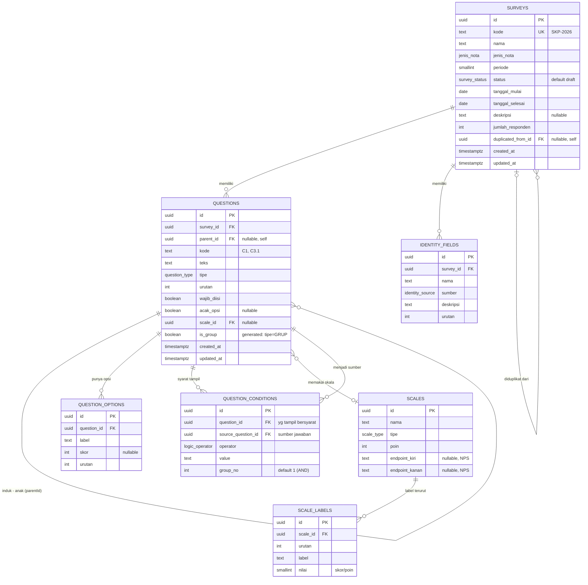

# Arsitektur Database (ERD) — Pelindo Survey CMS

Rancangan skema relasional untuk **backend nyata**, diturunkan langsung dari model data front-end
(`src/types/index.ts`) dan invarian store (`src/store/useSurveyStore.ts`). Saat ini aplikasi tidak
punya backend (data in-memory, lihat [ARCHITECTURE.md](ARCHITECTURE.md)); dokumen ini adalah cetak
biru untuk fase backend.

- **DBMS default:** **PostgreSQL 14+** (dipilih karena `ENUM`, generated column, partial index,
  `JSONB`). Catatan adaptasi MySQL/SQLite ada di [§9](#9-adaptasi-dbms-lain).
- **Ruang lingkup inti** ([§3](#3-skema-inti)) = padanan 1:1 dengan aplikasi saat ini.
- **Fase 2** ([§7](#7-fase-2--responden--jawaban-opsional)) = tabel responden/jawaban (mendukung
  `jumlahResponden` & tab Hasil yang kini masih stub) — opsional, dipisah agar inti tetap minimal.

---

## 1. Diagram ERD



**Relasi ringkas:**

| Relasi | Kardinalitas | FK |
|---|---|---|
| Survey → Question | 1 : N (cascade delete) | `questions.survey_id` |
| Question → Question (hirarki) | 1 : N self-ref (cascade) | `questions.parent_id` |
| Question → QuestionOption | 1 : N (cascade) | `question_options.question_id` |
| Question → QuestionCondition (target) | 1 : N (cascade) | `question_conditions.question_id` |
| Question → QuestionCondition (sumber) | 1 : N (restrict) | `question_conditions.source_question_id` |
| Question → Scale | N : 1 opsional | `questions.scale_id` |
| Scale → ScaleLabel | 1 : N (cascade) | `scale_labels.scale_id` |
| Survey → IdentityField | 1 : N (cascade) | `identity_fields.survey_id` |
| Survey → Survey (duplikat) | N : 1 opsional self-ref | `surveys.duplicated_from_id` |

---

## 2. Keputusan Desain

Beberapa hal di model front-end perlu disesuaikan agar relasional dan benar di sisi server:

| Topik | Di front-end (in-memory) | Di database | Alasan |
|---|---|---|---|
| **Opsi pertanyaan** | array `Question.options[]` | tabel `question_options` | Normalisasi → bisa di-query/agregasi per opsi |
| **Logika tampil** | objek `Question.logic` (ConditionGroup) | tabel `question_conditions` | 1 baris per kondisi; `group_no` menyiapkan OR antar-grup |
| **Label skala** | array `Scale.labels[]` | tabel `scale_labels` (+ `nilai`) | Terurut + menyimpan bobot skor; alternatif `JSONB` di §9 |
| **Referensi logika** | `sourceQuestionKode` (string "C3") | `source_question_id` (FK) | Integritas referensial; `kode` bisa berubah |
| **Sumber duplikat** | `duplicatedFrom` (kode) | `duplicated_from_id` (FK self) | FK lebih kuat daripada kode lepas |
| **`jumlahPertanyaan`** | disimpan, dijaga action | **TIDAK disimpan** → view `survey_stats` | Hindari data ganda; DB hitung murah (lihat [§6](#6-denormalized-counts)) |
| **`childCount`** | disimpan, dijaga action | **TIDAK disimpan** → dihitung saat baca | Sama seperti di atas |
| **`isGroup`** | flag bool tersimpan | generated column `tipe = 'GRUP'` | Tak mungkin tidak sinkron dengan `tipe` |
| **Enum** | union type TS | `ENUM` PostgreSQL | Validasi di level DB |
| **ID** | `genId('q')` → `"q_1042"` | `uuid` (PK) + `kode` (business key) | ID stabil & tak bisa ditebak; `kode` tetap untuk tampilan |
| **Status arsip** | `status = 'arsip'` | tetap kolom status (bukan soft-delete row) | Arsip = state, bukan penghapusan |
| **Timestamp** | hanya Survey | semua tabel `created_at` / `updated_at` | Higiene audit; `updated_at` via trigger |

**Catatan `jenis_nota`:** dimodelkan sebagai `ENUM` mengikuti aplikasi. Karena ada tab **Master Data**,
nilai ini berpotensi jadi tabel lookup (`ref_jenis_nota`) di masa depan — lihat [§8](#8-master-data-lookup-future).

---

## 3. Skema Inti (DDL PostgreSQL)

### 3.1 Enum & ekstensi

```sql
CREATE EXTENSION IF NOT EXISTS pgcrypto;   -- gen_random_uuid()

CREATE TYPE survey_status  AS ENUM ('draft', 'aktif', 'selesai', 'arsip');
CREATE TYPE jenis_nota     AS ENUM ('Domestik', 'Internasional', 'SPSL Group');
CREATE TYPE question_type  AS ENUM (
  'GRUP', 'SKALA_KEPUASAN', 'SKALA_PERSETUJUAN', 'NPS',
  'YA_TIDAK', 'PILIHAN_TUNGGAL', 'PILIHAN_GANDA', 'TEKS'
);
CREATE TYPE identity_source AS ENUM ('OTOMATIS', 'ISIAN', 'PILIHAN', 'SISTEM');
CREATE TYPE logic_operator  AS ENUM ('sama_dengan', 'tidak_sama_dengan');
CREATE TYPE scale_type      AS ENUM ('KEPUASAN', 'PERSETUJUAN', 'NPS');
```

### 3.2 `scales` & `scale_labels` (global, tidak terikat survei)

```sql
CREATE TABLE scales (
  id            uuid PRIMARY KEY DEFAULT gen_random_uuid(),
  nama          text        NOT NULL,
  tipe          scale_type  NOT NULL,
  poin          smallint    NOT NULL CHECK (poin BETWEEN 2 AND 11),
  endpoint_kiri  text,       -- hanya NPS
  endpoint_kanan text,       -- hanya NPS
  created_at    timestamptz NOT NULL DEFAULT now(),
  updated_at    timestamptz NOT NULL DEFAULT now()
);

CREATE TABLE scale_labels (
  id        uuid PRIMARY KEY DEFAULT gen_random_uuid(),
  scale_id  uuid     NOT NULL REFERENCES scales(id) ON DELETE CASCADE,
  urutan    smallint NOT NULL,        -- 0-based
  label     text     NOT NULL,        -- "Sangat puas", "10"
  nilai     smallint NOT NULL,        -- bobot/poin: 1..4 atau 0..10
  UNIQUE (scale_id, urutan)
);
```

### 3.3 `surveys`

```sql
CREATE TABLE surveys (
  id                  uuid PRIMARY KEY DEFAULT gen_random_uuid(),
  kode                text          NOT NULL UNIQUE,     -- "SKP-2026"
  nama                text          NOT NULL,
  jenis_nota          jenis_nota    NOT NULL,
  periode             smallint      NOT NULL,            -- tahun
  status              survey_status NOT NULL DEFAULT 'draft',
  tanggal_mulai       date          NOT NULL,
  tanggal_selesai     date          NOT NULL,
  deskripsi           text,
  jumlah_responden    integer       NOT NULL DEFAULT 0,  -- atau derive dari responses (Fase 2)
  duplicated_from_id  uuid          REFERENCES surveys(id) ON DELETE SET NULL,
  created_at          timestamptz   NOT NULL DEFAULT now(),
  updated_at          timestamptz   NOT NULL DEFAULT now(),  -- = terakhirDiubah
  CHECK (tanggal_selesai >= tanggal_mulai)
);
```

### 3.4 `questions` (flat + hirarki via `parent_id`)

```sql
CREATE TABLE questions (
  id          uuid PRIMARY KEY DEFAULT gen_random_uuid(),
  survey_id   uuid          NOT NULL REFERENCES surveys(id)  ON DELETE CASCADE,
  parent_id   uuid          REFERENCES questions(id)         ON DELETE CASCADE,
  kode        text          NOT NULL,                 -- "C1", "C3.1"
  teks        text          NOT NULL,
  tipe        question_type NOT NULL,
  urutan      integer       NOT NULL,
  wajib_diisi boolean       NOT NULL DEFAULT false,
  acak_opsi   boolean,                                -- hanya tipe pilihan
  scale_id    uuid          REFERENCES scales(id) ON DELETE RESTRICT,
  is_group    boolean       GENERATED ALWAYS AS (tipe = 'GRUP') STORED,
  created_at  timestamptz   NOT NULL DEFAULT now(),
  updated_at  timestamptz   NOT NULL DEFAULT now(),

  UNIQUE (survey_id, kode),
  -- skala hanya untuk tipe skala; opsi (acak) hanya untuk tipe pilihan
  CHECK (scale_id IS NULL OR tipe IN ('SKALA_KEPUASAN','SKALA_PERSETUJUAN','NPS')),
  CHECK (acak_opsi IS NULL OR tipe IN ('PILIHAN_TUNGGAL','PILIHAN_GANDA'))
);

CREATE INDEX idx_questions_survey  ON questions (survey_id, urutan);
CREATE INDEX idx_questions_parent  ON questions (parent_id);
```

> **Hierarki:** sama seperti front-end — flat array + `parent_id`. `ON DELETE CASCADE` pada
> `parent_id` mereplikasi `deleteQuestion` yang menghapus seluruh keturunan (invarian #2 di ARCHITECTURE.md).

### 3.5 `question_options`

```sql
CREATE TABLE question_options (
  id          uuid PRIMARY KEY DEFAULT gen_random_uuid(),
  question_id uuid    NOT NULL REFERENCES questions(id) ON DELETE CASCADE,
  label       text    NOT NULL,
  skor        integer,                 -- dipakai PILIHAN_TUNGGAL
  urutan      integer NOT NULL,
  UNIQUE (question_id, urutan)
);

CREATE INDEX idx_options_question ON question_options (question_id);
```

### 3.6 `question_conditions` (logika tampil)

```sql
CREATE TABLE question_conditions (
  id                  uuid PRIMARY KEY DEFAULT gen_random_uuid(),
  question_id         uuid           NOT NULL REFERENCES questions(id) ON DELETE CASCADE,
  source_question_id  uuid           NOT NULL REFERENCES questions(id) ON DELETE CASCADE,
  operator            logic_operator NOT NULL,
  value               text           NOT NULL,
  group_no            smallint       NOT NULL DEFAULT 1,  -- AND dalam grup; OR antar-grup (future)
  urutan              smallint       NOT NULL DEFAULT 1,
  CHECK (question_id <> source_question_id)              -- tak boleh bergantung pada diri sendiri
);

CREATE INDEX idx_conditions_question ON question_conditions (question_id);
CREATE INDEX idx_conditions_source   ON question_conditions (source_question_id);
```

> Model front-end kini hanya 1 `ConditionGroup` (semua AND). `group_no` disiapkan agar nanti bisa
> "OR antar grup, AND di dalam grup" tanpa migrasi struktur.

### 3.7 `identity_fields`

```sql
CREATE TABLE identity_fields (
  id          uuid PRIMARY KEY DEFAULT gen_random_uuid(),
  survey_id   uuid            NOT NULL REFERENCES surveys(id) ON DELETE CASCADE,
  nama        text            NOT NULL,
  sumber      identity_source NOT NULL,
  deskripsi   text            NOT NULL DEFAULT '',
  urutan      integer         NOT NULL,
  created_at  timestamptz     NOT NULL DEFAULT now(),
  updated_at  timestamptz     NOT NULL DEFAULT now(),
  UNIQUE (survey_id, urutan)
);
```

### 3.8 Trigger `updated_at` (opsional tapi disarankan)

```sql
CREATE OR REPLACE FUNCTION set_updated_at() RETURNS trigger AS $$
BEGIN NEW.updated_at = now(); RETURN NEW; END;
$$ LANGUAGE plpgsql;

CREATE TRIGGER trg_surveys_updated   BEFORE UPDATE ON surveys
  FOR EACH ROW EXECUTE FUNCTION set_updated_at();
CREATE TRIGGER trg_questions_updated BEFORE UPDATE ON questions
  FOR EACH ROW EXECUTE FUNCTION set_updated_at();
-- ulangi untuk tabel lain sesuai kebutuhan
```

---

## 4. Pemetaan Tipe TS → Kolom DB

| `src/types/index.ts` | Tabel.kolom | Catatan |
|---|---|---|
| `Survey.id` | `surveys.id` | `string` → `uuid` |
| `Survey.kode` | `surveys.kode` | unique |
| `Survey.jenisNota` | `surveys.jenis_nota` | enum |
| `Survey.periode` | `surveys.periode` | `number` → `smallint` |
| `Survey.status` | `surveys.status` | enum, default `draft` |
| `Survey.terakhirDiubah` | `surveys.updated_at` | via trigger |
| `Survey.createdAt` | `surveys.created_at` | |
| `Survey.jumlahPertanyaan` | — (view `survey_stats`) | derived, [§6](#6-denormalized-counts) |
| `Survey.jumlahResponden` | `surveys.jumlah_responden` | atau derive (Fase 2) |
| `Survey.duplicatedFrom` | `surveys.duplicated_from_id` | kode → FK self |
| `Question.parentId` | `questions.parent_id` | self-FK, nullable |
| `Question.tipe` | `questions.tipe` | enum |
| `Question.wajibDiisi` | `questions.wajib_diisi` | |
| `Question.acakOpsi` | `questions.acak_opsi` | hanya tipe pilihan |
| `Question.scaleId` | `questions.scale_id` | FK, hanya tipe skala |
| `Question.isGroup` | `questions.is_group` | generated column |
| `Question.childCount` | — (dihitung saat baca) | derived |
| `Question.options[]` | tabel `question_options` | normalisasi |
| `Question.logic` | tabel `question_conditions` | normalisasi |
| `QuestionOption.skor` | `question_options.skor` | |
| `Condition.sourceQuestionKode` | `question_conditions.source_question_id` | kode → FK |
| `Condition.operator` | `question_conditions.operator` | enum |
| `Scale.labels[]` | tabel `scale_labels` | + `nilai` (bobot) |
| `Scale.poin` | `scales.poin` | |
| `Scale.endpointKiri/Kanan` | `scales.endpoint_kiri/kanan` | NPS |
| `IdentityField.sumber` | `identity_fields.sumber` | enum |

---

## 5. Pemetaan Endpoint (lapisan `src/data/*` → SQL)

Setiap fungsi di `src/data/*` sudah diberi komentar route REST. Inilah query backend yang setara:

| Fungsi front-end | Route | Query inti |
|---|---|---|
| `filterSurveys` | `GET /api/surveys` | `SELECT … FROM surveys WHERE … ORDER BY created_at DESC` |
| `computeSummary` | `GET /api/surveys/summary` | agregasi `COUNT(*) FILTER (WHERE status=…)`, `SUM(jumlah_responden)` |
| `getSurvey` | `GET /api/surveys/:id` | `SELECT … WHERE id = $1` |
| `createSurvey` (blank) | `POST /api/surveys` | `INSERT INTO surveys …` |
| `createSurvey` (duplicate) | `POST /api/surveys` | transaksi: insert survey + salin questions/options/conditions/identity dengan remap id (lihat [§6.2](#62-duplikasi-survei)) |
| `updateSurvey` / `activateSurvey` / `archiveSurvey` | `PATCH /api/surveys/:id` | `UPDATE surveys SET … WHERE id = $1` |
| `getQuestions` / `buildTree` | `GET /api/surveys/:id/questions` | `SELECT … WHERE survey_id=$1 ORDER BY urutan`; pohon disusun klien atau via recursive CTE |
| `addQuestion` | `POST /api/surveys/:id/questions` | `INSERT INTO questions …` |
| `updateQuestion` | `PATCH …/questions/:qid` | `UPDATE questions …` (+ replace options/conditions bila ikut berubah) |
| `deleteQuestion` | `DELETE …/questions/:qid` | `DELETE FROM questions WHERE id=$1` → cascade keturunan |
| `reorderQuestions` | `POST …/questions/reorder` | batch `UPDATE … SET urutan, parent_id` dalam transaksi |
| `getScales` / `getScale` | `GET /api/scales` | `SELECT … FROM scales JOIN scale_labels …` |
| `getIdentityFields` / `reorderIdentityFields` | `GET / POST …/identity-fields` | `SELECT … ORDER BY urutan` / batch update |

---

## 6. Denormalized Counts

Front-end **menyimpan** `jumlahPertanyaan` & `childCount` dan menjaganya di dalam action (invarian #1).
Di database, sumber kebenaran tunggal lebih aman — **hitung saat baca**:

```sql
-- jumlah pertanyaan non-grup per survei (padanan countNonGroup)
CREATE VIEW survey_stats AS
SELECT s.id AS survey_id,
       COUNT(q.id) FILTER (WHERE NOT q.is_group) AS jumlah_pertanyaan
FROM surveys s
LEFT JOIN questions q ON q.survey_id = s.id
GROUP BY s.id;

-- childCount per pertanyaan (padanan recalcChildCount), saat menyajikan tree:
-- SELECT q.*, (SELECT COUNT(*) FROM questions c WHERE c.parent_id = q.id) AS child_count
-- FROM questions q WHERE q.survey_id = $1;
```

> **Alternatif** bila count jadi hot-path: simpan kolom denormalized + trigger `AFTER INSERT/DELETE`
> pada `questions` — meniru persis perilaku store. Untuk skala SKP, view sudah cukup.

### 6.2 Duplikasi survei

Padanan SQL dari `createSurvey({ method: 'duplicate' })` (remap id agar `parent_id` tetap konsisten),
dijalankan dalam **satu transaksi**:

```sql
-- 1) buat survey baru, simpan duplicated_from_id
-- 2) salin questions dengan id baru; pertahankan peta old_id → new_id (mis. temp table)
-- 3) UPDATE parent_id klon memakai peta tsb.
-- 4) salin question_options & question_conditions (remap question_id & source_question_id)
-- 5) salin identity_fields
```

`WITH … RETURNING` + tabel pemetaan sementara, atau lakukan di kode aplikasi dalam transaksi.

---

## 7. Fase 2 — Responden & Jawaban (opsional)

Belum ada di front-end (tab Hasil masih stub), tapi `jumlah_responden` dan halaman Hasil
mengisyaratkannya. Skema minimal:

```sql
CREATE TABLE responses (
  id            uuid PRIMARY KEY DEFAULT gen_random_uuid(),
  survey_id     uuid        NOT NULL REFERENCES surveys(id) ON DELETE CASCADE,
  submitted_at  timestamptz NOT NULL DEFAULT now(),
  selesai       boolean     NOT NULL DEFAULT true
);

CREATE TABLE answers (
  id            uuid PRIMARY KEY DEFAULT gen_random_uuid(),
  response_id   uuid NOT NULL REFERENCES responses(id) ON DELETE CASCADE,
  question_id   uuid NOT NULL REFERENCES questions(id) ON DELETE CASCADE,
  value_text    text,      -- TEKS, YA_TIDAK
  value_number  integer,   -- skala / NPS
  UNIQUE (response_id, question_id)
);

-- PILIHAN_GANDA (multi-select): satu baris per opsi terpilih
CREATE TABLE answer_options (
  answer_id uuid NOT NULL REFERENCES answers(id) ON DELETE CASCADE,
  option_id uuid NOT NULL REFERENCES question_options(id) ON DELETE CASCADE,
  PRIMARY KEY (answer_id, option_id)
);

-- nilai identitas per responden
CREATE TABLE response_identity_values (
  response_id       uuid NOT NULL REFERENCES responses(id) ON DELETE CASCADE,
  identity_field_id uuid NOT NULL REFERENCES identity_fields(id) ON DELETE CASCADE,
  value             text NOT NULL,
  PRIMARY KEY (response_id, identity_field_id)
);
```

Dengan ini, `jumlah_responden` = `COUNT(responses WHERE survey_id=…)` dan tab Hasil mengagregasi `answers`.

---

## 8. Master Data / Lookup (future)

Tab **Master Data** (PRD §8.6, kini stub) kemungkinan mengelola nilai lookup. Bila `jenis_nota`
perlu dikelola admin (bukan hardcoded), ganti `ENUM` jadi tabel referensi:

```sql
CREATE TABLE ref_jenis_nota (
  kode  text PRIMARY KEY,   -- 'DOMESTIK'
  nama  text NOT NULL,      -- 'Domestik'
  aktif boolean NOT NULL DEFAULT true
);
-- lalu surveys.jenis_nota_kode text REFERENCES ref_jenis_nota(kode)
```

Trade-off: lebih fleksibel, tapi kehilangan validasi enum statis. Lakukan hanya bila benar-benar
perlu dikelola dari UI.

---

## 9. Adaptasi DBMS Lain

| Fitur Postgres dipakai | MySQL 8 | SQLite |
|---|---|---|
| `ENUM` type | `ENUM(...)` inline pada kolom | `TEXT` + `CHECK (col IN (...))` |
| `uuid` + `gen_random_uuid()` | `BINARY(16)`/`CHAR(36)` + `UUID()` | `TEXT` + UUID dari aplikasi |
| `GENERATED ALWAYS AS … STORED` | sama (`GENERATED`) | `GENERATED ALWAYS AS … VIRTUAL` |
| `COUNT(*) FILTER (WHERE …)` | `SUM(CASE WHEN … THEN 1 ELSE 0 END)` | sama seperti MySQL |
| `timestamptz` | `TIMESTAMP` | `TEXT` (ISO-8601) |
| array `scale_labels` (atau `JSONB`) | `JSON` | `TEXT` JSON |
| partial index | terbatas | terbatas |

Untuk prototipe cepat, label skala/opsi boleh disimpan `JSONB` (`scales.labels jsonb`) alih-alih tabel
terpisah — lebih dekat ke bentuk front-end, tapi sulit di-query/agregasi per label.

---

## 10. Langkah Integrasi ke Aplikasi

1. **Pilih stack backend** (mis. Node + Prisma/Drizzle, atau Postgres + REST/GraphQL). Skema di sini
   memetakan langsung ke schema Prisma/Drizzle.
2. **Buat migrasi** dari DDL §3.
3. **Seed** dari `src/store/seed.ts` (sudah berisi data PRD §12) — terjemahkan array jadi `INSERT`.
4. **Ganti isi `src/data/*`** dari `useSurveyStore.getState()` menjadi `fetch` (lihat §11
   [ARCHITECTURE.md](ARCHITECTURE.md)). Signature fungsi tetap → komponen UI tidak berubah; yang
   berubah: helper baca jadi async, komponen menambah loading/error state.
5. **Pindahkan invarian ke server:** count via view (§6), cascade via FK `ON DELETE CASCADE`,
   `is_group` via generated column, `kode` otomatis (`nextKode`) jadi logika service/trigger.
6. **Transaksi** untuk operasi multi-tabel: duplikasi survei (§6.2) dan reorder.
